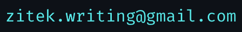
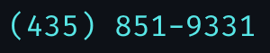

# CS 1400 — Programming Fundementals

Welcome! This is Pluto's repository for the Fall 2022 class of CS 1400.

Table of Contents
===

<!--ts-->
* [Weekly Projects](#weekly-projects)
   * [2022-08-29](#2022-08-29)
* [Contact Information](#contact-information)
<!--te-->

## Weekly Projects

Each week's projects are listed here under the respective header.

### 2022-08-29
### 2022-09-05
### 2022-09-12
### 2022-09-19
### 2022-09-26
### 2022-10-03
### 2022-10-10
### 2022-10-17
### 2022-10-24
### 2022-10-31
### 2022-11-07
### 2022-11-14
### 2022-11-21
### 2022-11-28
### 2022-12-05
### 2022-12-12

## Contact Information

I can be reached via:
* \[Email\]: 

* \[SMS\]: 
